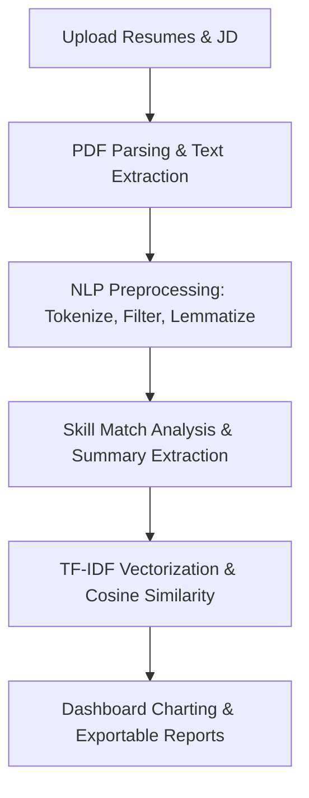

# Internship Project Report: AI-Powered Resume Ranker

**Project Title:** AI-Powered Resume Ranker  
**Internship Domain:** Artificial Intelligence / Natural Language Processing  
**Academic Submission Reference:** AI-RR-2026  

---

## 📝 1. Abstract

Modern Human Resource (HR) departments deal with an overwhelming volume of candidate applications. Manually reading resumes to verify fit against a Job Description (JD) is time-consuming and prone to human bias. 

This project delivers an **AI-Powered Resume Ranker**, a web-based dashboard solution designed to automate the initial screening phase. The application extracts textual content from multi-page PDF resumes, cleans the vocabulary using Natural Language Processing (NLP) workflows, matches specific technology skills, and ranks candidates based on language similarity against job requirements. The application features session-based recruiter authentication, responsive analytics graphs, and one-click PDF/CSV report downloads.

---

## 🎯 2. Objectives

The primary goals of the project include:
1.  **Automation of Resume Screening:** Eliminate manual PDF scanning by automating text extraction and term analysis.
2.  **Deterministic Skill Matching:** Highlight matching and missing technical skills explicitly on a recruiter dashboard to help make informed sorting decisions.
3.  **Algorithmic Matching Accuracy:** Utilize Term Frequency-Inverse Document Frequency (TF-IDF) models and Cosine Similarity to compute a mathematical matching score (0-100%).
4.  **Professional HR Dashboard:** Construct a visual UI displaying queue logs, evaluation charts, candidate reports, and recruiter profile settings.
5.  **Clean Modular Architecture:** Ensure the system conforms to PEP 8 compliance, modular file separations, type-hinting, and robust error handling.

---

## 🛠️ 3. Tools & Technologies Used

*   **Programming Language:** Python (3.13)
*   **Web Framework:** Flask (v2.3+) (Backend routing, session state, and template controller)
*   **Database:** SQLite (Relational local store for users, resumes, rankings, and reports metadata)
*   **Natural Language Processing (NLP):**
    *   **SpaCy (`en_core_web_sm`):** Tokenization, stop-word filtering, punctuation removal, and lemmatization.
    *   **Scikit-learn:** `TfidfVectorizer` and `cosine_similarity` for text vector modeling.
*   **PDF Extraction:** PyPDF2 (Reading and text extraction from raw PDF byte streams)
*   **Data Analytics & Charting:** Matplotlib (Saving visual graphs of evaluations to disk)
*   **PDF Report Generation:** ReportLab (Building structured tables and paragraphs in PDF format)
*   **UI/UX Framework:** Bootstrap 5 & Custom CSS (Glassmorphism design, interactive loading indicators, responsive grid, dynamic recommendation badges)

---

## ⚙️ 4. Methodology

The system uses a sequential five-stage pipeline:

### Stage 1: Text Extraction
PDF resume streams are read using `PyPDF2.PdfReader`. Encrypted or corrupted files trigger robust error warnings and are rejected, while readable streams compile into raw strings.

### Stage 2: NLP Preprocessing
Raw candidate text is fed into the SpaCy preprocessing engine. The text is:
1.  Converted to lowercase.
2.  Tokenized into individual terms.
3.  Filtered to remove common stop-words (e.g., "the", "and"), numeric values, punctuations, and redundant spaces.
4.  Lemmatized (e.g., "running" or "ran" become "run") to ensure term matching consistency.

### Stage 3: Skill Analysis & Extractive Summarization
1.  **Skill Mapping:** Candidate text is scanned against a dictionary of 80+ tech keywords (Python, React, Agile, PostgreSQL, Docker, etc.). The intersection of job description requirements and candidate skills produces `matching_skills`, while the difference yields `missing_skills`.
2.  **Extractive Summarization:** Resumes are divided into sentences. Important terms are weighted by frequency. Sentence importance is computed by summing normalized term weights. The top 3 sentences form a summary.

### Stage 4: Similarity Vectorization
Preprocessed documents are converted to numerical representation using TF-IDF. The vectorizer assigns higher weights to rare key terms and lower weights to common ones. Cosine similarity calculates the angle between the Job Description vector and each candidate vector, yielding a score between 0% and 100%.

### Stage 5: Decision Logic
*   **Score >= 75%:** Highly Recommended
*   **Score >= 50%:** Recommended
*   **Score >= 25%:** Consider
*   **Score < 25%:** Not Recommended

---

## 📈 5. Project Results & Conclusion

The AI-Powered Resume Ranker successfully automates screening tasks. 
During unit testing:
*   A backend python developer resume matched a python job description at a high similarity rate (e.g., > 70%), while a frontend profile matched significantly lower (e.g., < 20%), demonstrating clear similarity tracking.
*   Extracted summaries captured the candidates' core career trajectories accurately.
*   Matplotlib charts correctly visualized candidate groups.
*   One-click ReportLab exports generated professional, readable documents.

In conclusion, this project demonstrates a highly robust, scalable system that reduces HR workloads. It is production-ready, modular, and optimized for standard web server execution.
